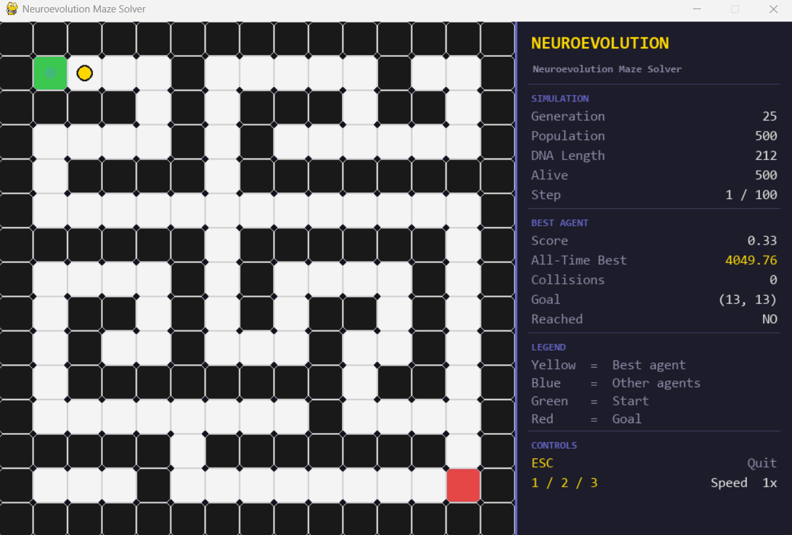

# 🧬 Genetic Maze Solver

 A project exploring different AI approaches for solving a grid-based maze — evolving agents to reach the goal efficiently.

---
 
## Demo
 
### v1 — Pure Genetic Algorithm
 

### v2 — Neuroevolution

---

##  Project Structure

```
genetic-maze-solver/
├── v1_pure_genetic/
│   ├── agent.py          # Agent class with DNA and fitness logic
│   ├── environment.py    # Maze definition and BFS distance utility
│   ├── population.py     # Selection, crossover, mutation
│   └── main.py           # Pygame visualization and main loop
├── v2_neuroevolution/
│   ├── agent.py          # Agent with neural network brain
│   ├── environment.py    # Maze definition and BFS distance utility
│   ├── neural_network.py # Feedforward neural network (ReLU, He init)
│   ├── population.py     # Selection, crossover, mutation over NN weights
│   └── main.py           # Pygame visualization and main loop
└── README.md
```
---

## ️ Project Roadmap

| Version | Approach | Status    |
|---------|----------|-----------|
| v1 | Pure Genetic Algorithm | Complete  |
| v2 | Neuroevolution (GA-evolved neural networks) | Complete  |

---

## v1 — Pure Genetic Algorithm

Agents carry a fixed-length DNA sequence of movement directions. Over generations, the population evolves through selection, crossover, and mutation to find a path from start to goal.

### Algorithm Details

| Parameter | Value |
|-----------|-------|
| Population size | 200 agents |
| DNA length | 75 steps |
| Selection | Roulette wheel (fitness-proportional) |
| Crossover | Uniform (50% per gene) |
| Mutation rate | 5% |
| Elitism | Best agent preserved each generation |
| Fitness | BFS-based true path distance + goal bonus |

### Fitness Function

- Reward is based on the **closest BFS distance** the agent ever reached to the goal (best distance is monotonically tracked — score never drops for backtracking)
- Exponential reward: `(10 / (best_distance + 1))²`
- **Goal bonus:** `1000 + (dna_length - move_count) × 20` — faster agents are rewarded more
- **Collision penalty:** `-0.01` per wall collision
- Minimum fitness score is clamped to `0.01`

### Setup & Run

```bash
    pip install numpy pygame
    cd v1_pure_genetic
    python main.py
```
## v2 — Neuroevolution (Coming Soon)

Instead of a fixed movement sequence, each agent has a small feedforward neural network that decides the next move based on observations of the environment. The genetic algorithm evolves the network weights directly — no backpropagation.

### Architecture
 
```
Input (8)  →  Hidden (16, ReLU)  →  Output (4)
```

| Input | Description |
|-------|-------------|
| 4 values | Distance to nearest wall in each direction (normalized) |
| 1 value | BFS distance to goal (normalized by rows + cols) |
| 2 values | Relative position to goal (row, col) |
| 1 value | Visit count of current cell (loop awareness) |


### Algorithm Details
 
| Parameter | Value                                           |
|-----------|-------------------------------------------------|
| Population size | 500 agents                                      |
| Max steps per generation | 100                                             |
| Selection | Roulette wheel (fitness-proportional)           |
| Crossover | Uniform over flattened weight vector            |
| Mutation | Gaussian noise (σ = 0.5), rate = 10%            |
| Elitism | Best agent's weights preserved each generation  |
| Fitness | Same BFS-based function as v1 + revisit penalty |
 

### Fitness Function
 
- Same BFS-based distance reward as v1
- Goal bonus: `1000 + (move_limit - move_count) × 20`
- Collision penalty: `-0.0001` per wall hit
- Revisit penalty: `-0.005` per extra visit to already-seen cells (prevents looping)
- Minimum fitness clamped to `0.01`

### Setup & Run
 
```bash
pip install numpy pygame
cd v2_neuroevolution
python main.py
```

---
### Controls

| Key | Action |
|-----|--------|
| `1` / `2` / `3` | Speed multiplier |
| `ESC` | Quit |

### Visualization

| Color | Meaning |
|-------|---------|
| Yellow | Best agent (current generation) |
| Blue | All other agents |
| Green | Start point |
| Red | Goal point |

---


## Maze

The maze is a 15×15 grid defined in `environment.py`. Cells:
- `0` → Open path
- `1` → Wall
- `2` → Start (green)
- `3` → Goal (red)

BFS distances are computed lazily and cached per `(start, goal)` pair to avoid redundant computation across the population.

---

## v1 vs v2 Comparison
 
| | v1 Genetic | v2 Neuroevolution |
|-|------------|-------------------|
| Decision making | Fixed DNA sequence | Neural network |
| What evolves | Movement directions | Network weights |
| Environment awareness | None | Yes (local observations) |
| Loop handling | No | Yes (visit count input) |
| Generalisation | Fixed path | Adaptive behaviour |